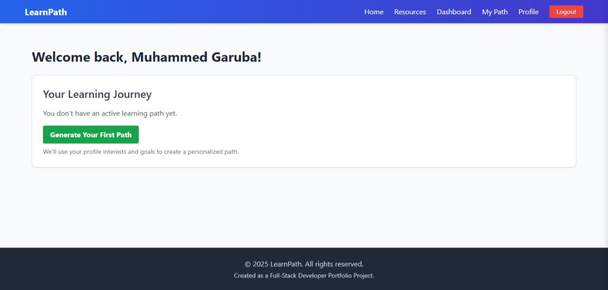
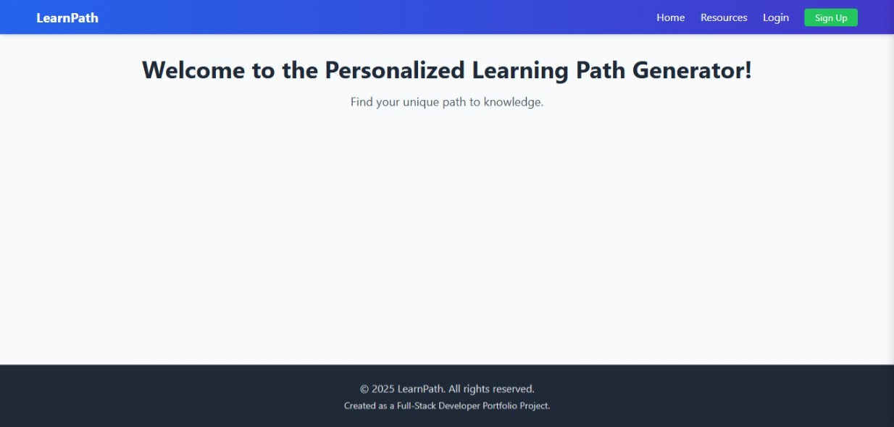
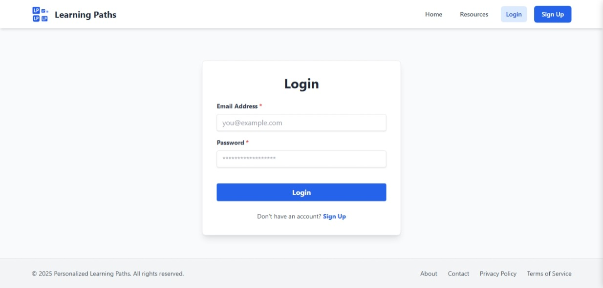
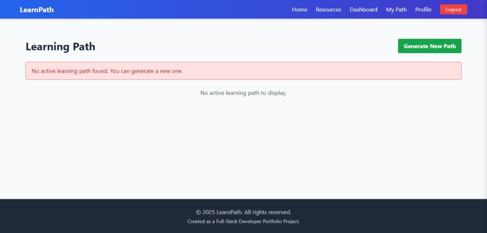
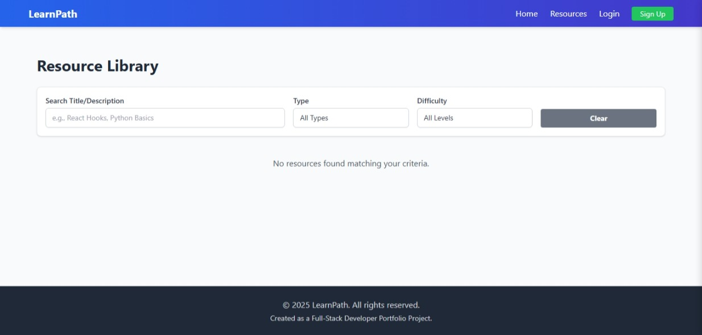
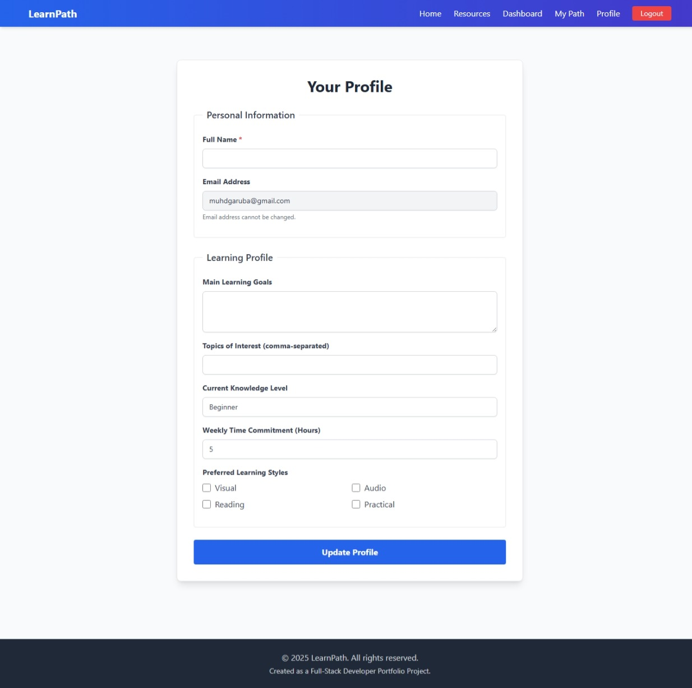

# LearnPath - Personalized Learning Path App

[](https://opensource.org/licenses/MIT) 

LearnPath is a full-stack web application designed to generate personalized learning paths for students based on their interests, goals, and current knowledge level. This application aims to empower lifelong learners by providing curated resources and a clear roadmap for their educational journey. This project was built as a portfolio piece to showcase full-stack development skills.

 

---

## Table of Contents

*   [Live Demo](#live-demo)
*   [Screenshots](#screenshots)
*   [Features Implemented](#features-implemented)
*   [Tech Stack](#tech-stack)
*   [Getting Started](#getting-started)
    *   [Prerequisites](#prerequisites)
    *   [Installation](#installation)
    *   [Environment Variables](#environment-variables)
    *   [Running the Application](#running-the-application)
*   [Deployment](#deployment)
*   [Challenges Faced & Solutions](#challenges-faced--solutions)
*   [Future Improvements](#future-improvements)
*   [Author](#author)

---

## Live Demo

🚀 **Check out the live application here:** [https://personalized-learning-path-app.vercel.app](https://personalized-learning-path-app.vercel.app)

*Note: The application is deployed using free-tier services, which may occasionally result in slower initial load times.*

---

## Screenshots

Here are some glimpses of the LearnPath application:

| Page                | Screenshot                                       |
| :------------------ | :----------------------------------------------- |
| Homepage            |                    |
| Login               |                 |
| Sign Up             |              |
| Dashboard           |              |
| Learning Path View  |  |
| Resource Library    |    |
| User Profile        |             |


---

## Features Implemented

*   **User Authentication:** Secure Sign-up and Login functionality using JWT (JSON Web Tokens).
*   **User Onboarding:** Initial assessment during signup to gather learning preferences, goals, interests, current level, and time commitment.
*   **Personalized Dashboard:** Overview of the user's active learning path, progress indicators, upcoming steps, and welcome message.
*   **Learning Path Generation:** Algorithm (currently basic, based on interests/level) to create customized learning sequences using available resources. Option to generate a new path.
*   **Learning Path Visualization:** Simple list view of the generated path with resource details (title, type, difficulty) and sequence.
*   **Progress Tracking:** Users can update the status (`Not Started`, `In Progress`, `Completed`) for each step (node) in their learning path. Progress is reflected on the dashboard.
*   **Resource Library:** Curated collection of learning resources (fetched from the database). Includes filtering by type/difficulty and basic text search.
*   **User Profile Management:** Users can view and update their profile information (name, goals, interests, level, preferences, time commitment).
*   **Responsive Design:** UI built with Tailwind CSS for responsiveness across different screen sizes.
*   **REST API Backend:** Backend built with Node.js and Express, providing API endpoints for frontend interaction.
*   **Database Integration:** MongoDB (via Mongoose) used for storing user data, resources, and learning paths.

---

## Tech Stack

*   **Frontend:**
    *   React.js (v18+) with Vite
    *   React Router DOM (v6) for routing
    *   Tailwind CSS for styling
    *   Axios for API requests
*   **Backend:**
    *   Node.js
    *   Express.js framework
    *   MongoDB Atlas (Database)
    *   Mongoose (ODM)
    *   JSON Web Token (JWT) for authentication
    *   bcryptjs for password hashing
    *   express-validator for input validation
    *   `cors` middleware
    *   `dotenv` for environment variables
*   **Deployment:**
    *   **Frontend:** Vercel (Free Tier)
    *   **Backend:** Railway (Free Tier)
    *   **CI/CD:** GitHub Actions (for backend deployment attempts/setup)
*   **Development:**
    *   Git & GitHub for version control
    *   Nodemon for backend hot-reloading
    *   VS Code (or preferred editor)

---

## Getting Started

Follow these instructions to get a copy of the project up and running on your local machine for development and testing purposes.

### Prerequisites

*   Node.js (v18.x or later recommended) & npm
*   Git
*   MongoDB Atlas Account (or local MongoDB installation)

### Installation

1.  **Clone the repository:**
    ```bash
    git clone https://github.com/Garbii1/personalized-learning-path-app.git
    cd personalized-learning-path-app
    ```

2.  **Install Backend Dependencies:**
    ```bash
    cd server
    npm install
    ```

3.  **Install Frontend Dependencies:**
    ```bash
    cd ../client
    npm install
    ```

### Environment Variables

You need to create `.env` files for both the server and client directories.

1.  **Backend (`server/.env`):**
    Create a file named `.env` in the `server` directory and add the following variables:
    ```env
    # .env (server) - DO NOT COMMIT THIS FILE
    PORT=5001 # Or any port you prefer
    MONGODB_URI=your_mongodb_connection_string # Get from MongoDB Atlas
    JWT_SECRET=your_very_strong_random_secret_key # Choose a strong random string
    ```
    *(Replace placeholders with your actual values)*

2.  **Frontend (`client/.env`):**
    Create a file named `.env` in the `client` directory and add the following variable (Vite requires the `VITE_` prefix):
    ```env
    # .env (client) - Safe to commit if only pointing to localhost for dev
    VITE_API_BASE_URL=http://localhost:5001/api # Your local backend API base URL
    ```
    *(Make sure the port matches the `PORT` in the server's `.env`)*

### Running the Application

1.  **Start the Backend Server:**
    Open a terminal in the `server` directory:
    ```bash
    npm run dev
    ```
    *(This uses nodemon for auto-restarts during development)*

2.  **Start the Frontend Development Server:**
    Open a *separate* terminal in the `client` directory:
    ```bash
    npm run dev
    ```
    *(This starts the Vite development server, usually on `http://localhost:5173`)*

3.  Open your browser and navigate to the frontend URL provided by Vite (e.g., `http://localhost:5173`).

---

## Deployment

*   **Backend:** Deployed on **Railway** using their free tier. The `main` branch is linked, and deployments can be triggered automatically or manually. Environment variables (`MONGODB_URI`, `JWT_SECRET`) are configured directly in the Railway service settings.
*   **Frontend:** Deployed on **Vercel** using their free tier. The project is linked to the GitHub repository, and Vercel automatically builds and deploys changes pushed to the `main` branch. The `VITE_API_BASE_URL` environment variable is configured in Vercel project settings to point to the deployed Railway backend URL.
*   **CI/CD:** GitHub Actions were explored for backend deployment automation. Initial setup faced challenges with action identification (`Missing download info`), which were resolved by using the Railway CLI within a Docker container step.

---

## Challenges Faced & Solutions

*   **Dependency Versioning (Tailwind CSS):** Initially attempted to use Tailwind CSS v4 (alpha), which caused errors with the standard `npx tailwindcss init -p` command (`could not determine executable`).
    *   **Solution:** Realized v4 was in alpha and its setup differed. Explicitly uninstalled v4 and installed the latest stable v3 release (`tailwindcss@^3`) along with compatible `postcss` and `autoprefixer` versions, resolving the initialization issue.
*   **Frontend-Backend Integration (404 Errors):** After deployment, API calls from the Vercel frontend to the Railway backend were failing with 404 errors. The requested URL incorrectly combined the frontend and backend domains (e.g., `vercel.app/railway.app/api/...`).
    *   **Solution:** Diagnosed the issue as an incorrectly configured `VITE_API_BASE_URL` environment variable in Vercel. The variable likely lacked the `https://` prefix or was otherwise malformed, causing Axios to treat it as a relative path. Corrected the value in Vercel settings to the full, absolute URL of the deployed Railway API (`https://<your-railway-app-url>/api`) and redeployed the frontend.
*   **CI/CD Setup (GitHub Actions for Railway):** Encountered multiple `Error: Missing download info` failures when setting up the GitHub Actions workflow for backend deployment. Tried various incorrect action names (`railway/cli-action`, `railway/cli`, `railwayapp/cli`).
    *   **Solution:** Through trial-and-error and checking documentation/repository names, identified and used the Railway CLI directly in a Docker container (`ghcr.io/railwayapp/cli:latest`) as alternative approach. The core issue often stemmed from typos. Ensuring the `RAILWAY_TOKEN` secret was correctly configured was also crucial.
*   **CORS Configuration:** Ensured the backend Express server included the `cors` middleware and configured it appropriately (initially permissive for development, then potentially restricted to the specific Vercel frontend domain for production).
*   **State Management & Data Fetching:** Implemented basic data fetching and state management using `useState` and `useEffect`. Handled loading and error states for API calls to provide user feedback. Used `Promise.allSettled` on the dashboard to fetch profile and path data concurrently while handling potential individual fetch failures gracefully.

---

## Future Improvements

*   **Advanced Recommendation Algorithm:** Implement a more sophisticated algorithm (e.g., content-based filtering, collaborative filtering, or basic ML) for resource and path suggestions based on user history and similar users.
*   **AI Enhancements:** Integrate NLP for analyzing resource content or user goals. Use AI for more dynamic path adjustments.
*   **Social Features:** Allow users to find peers, join discussion forums, share progress, or potentially connect with mentors.
*   **Gamification:** Add points, badges, streaks, and leaderboards to increase engagement.
*   **Content Creation Tools:** Allow educators or admins to create and manage resources and potentially pre-defined learning paths.
*   **Enhanced Path Visualization:** Implement a more visual timeline or roadmap view for learning paths (e.g., using libraries like `react-vertical-timeline-component`).
*   **Improved Testing:** Add unit and integration tests for both frontend components and backend API endpoints.
*   **Mobile App / PWA:** Convert the application to a Progressive Web App (PWA) or develop a React Native mobile version.
*   **Admin Panel:** Create a dedicated interface for managing users, resources, and site settings.

---

## Author

*   **Muhammed Babatunde Garuba**
    *   GitHub: [@Garbii1](https://github.com/Garbii1)

---

